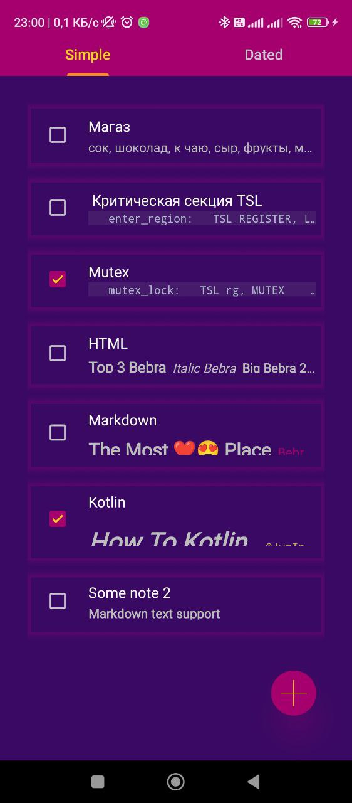
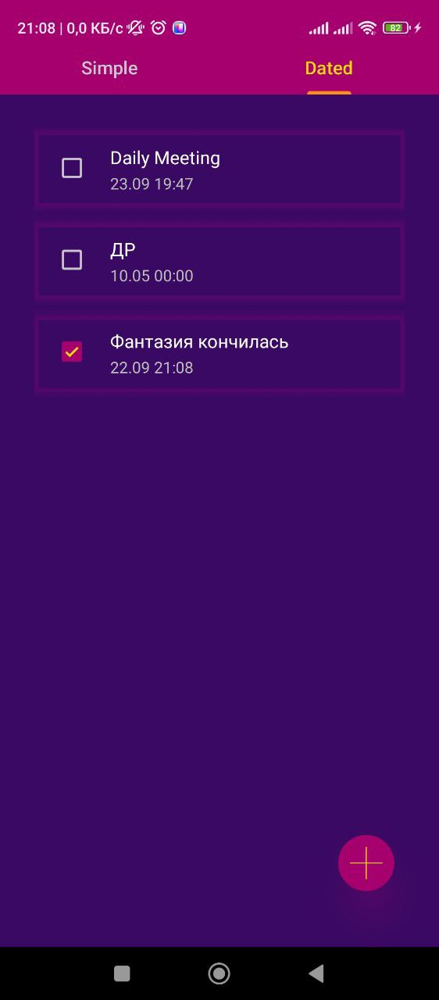
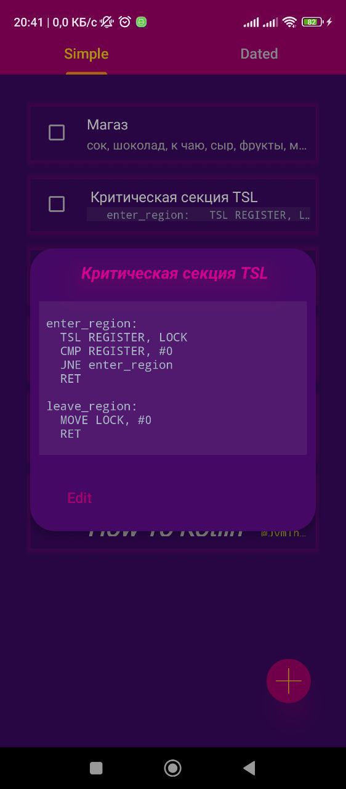
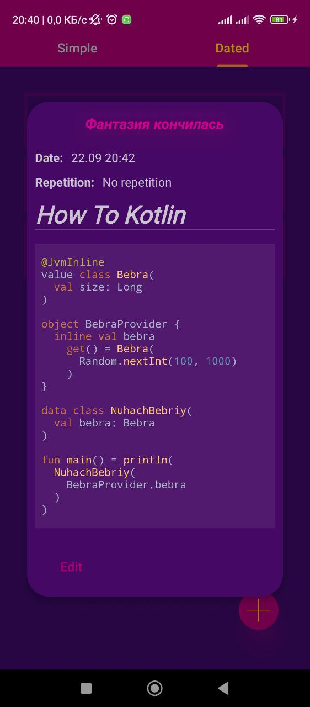
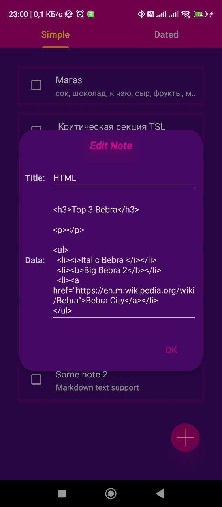
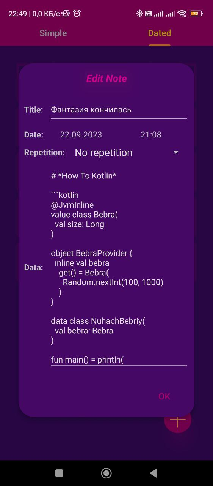
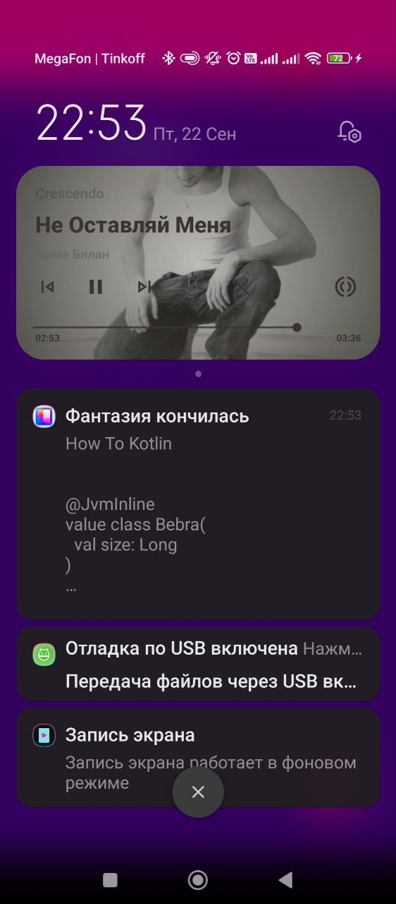

**Daily Planner**
-----------------

## **Developer**
[Paranid5](https://github.com/dinaraparanid)

## **About App**
**Daily Planner** is an Android planner/note application
that supports **complex and customizable messages** with
***Markdown*** support (+ basic ***HTML*** and ***syntax highlighting***).
Application supports both *simple* and *dated notes* + *regularity*
(daily, weekly, etc.) and *notifications*

### **Preview**

**Simple and Dated Notes**

    
    &nbsp;
    

**Notes' preview with the support of Markdown + Syntax Highlighting**

    
    &nbsp;
    

**Notes' editing**

    
    &nbsp;
    

**Receive notifications with Dated Notes**

## **Stack**

<ul>
    <li>Kotlin 1.9</li>
    <li>Coroutines + Flow</li>
    <li>Dagger Hilt + Assisted Inject</li>
    <li>Room + Coroutines and Flow extensions</li>
    <li>Retrofit</li>
    <li>Jackson</li>
    <li>KotlinX.DateTime</li>
    <li>Calendar + Java Date/Time API</li>
    <li>Easy Permissions</li>
    <li>Carbon</li>
    <li>Material 3</li>
    <li>AlarmManager + BroadcastReceiver</li>
    <li>AndroidX.ViewModel + SavedStateHandle</li>
    <li>AndroidX.ViewPager</li>
    <li>AndroidX.Fragment</li>
    <li>AndroidX.ConstraintLayout</li>
    <li>AndroidX.RecyclerView + AsyncListDiffer</li>
</ul>

## **Current Status:**

**Alpha V 0.1.0.1**

### **Implemented features:**
1. Simple and Dated notes
2. Complex formats preview support (Markdown + Syntax Highlighting)
3. Notes editing + markdown editor
4. Notes regularity (daily, weekly, monthly, yearly, none)
5. Notes cancellation and status change (is done or not)
6. Notifications and dated notes' status updates after them

### **TODO:**
1. Check for updates
2. Image support
3. Notifications' grouping (folders)

## **System Requirements**
**Android 5.0** or higher

## **License**
*GNU Public License V 3.0*